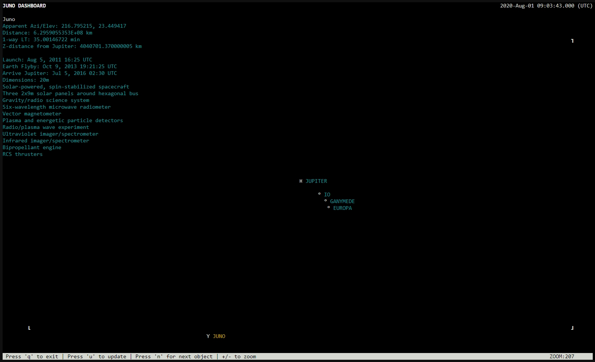

# Juno Perijove Tools
A selection of tools to help with Jovian observations during the Juno orbiter's perijoves.

# Installation and Requirements
Juno Perijove Tools works with Python 3 and later. Juno dashboard requires the python module curses to run. If it is not installed use the coomand:

'''pip install curses'''

# Using Juno Perijove Tools
Juno-dashboard.py shows the live position of Juno in relation to Jupiter and its moons.

Perijove.py displays an up-to-date list of Juno's predicted orbits from JPL's Navigation and Ancillary Information Facility (NAIF)'s SPICE data. Select a perijove to view the optimimum estimated observation time.

Horizons.py assists with queries to JPL HORIZONS, an on-line solar system data and ephemeris computation service. Include horizons.py and use the class HorizonsRequest to select a center, target, time, and quantities matching to what is available on the HORIZONS system's web-interface (https://ssd.jpl.nasa.gov/horizons.cgi). Keys can be added and modified. After the request has been sent you can retrieve a list of all lines of the response or a dictionary with the results of the query.
